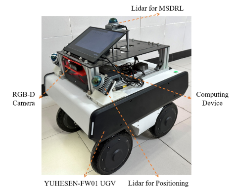
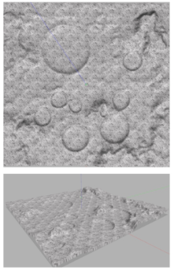
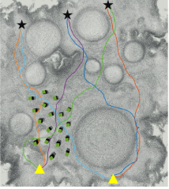

# MSDRL: A lightweight Modal Separation Deepreinforcement Learning method for Robot Navigation based on Reward Retrospective 

<p align = "center">



</p>

The source code will be released soon.

# Directory

```
|--scout_gazebo_sim                 Gazebo simulation of robot

|--scout_description                Model description file of robot

|--config
    ---- config.yaml                 >> Config Files <<          
    ---- config_dqn_pose.yaml        RL + pose
    ---- config_dqn_point.yaml       RL + pose/point
    ---- config_dqn_multi.yaml       RL + pose/point/image
    --------------- related to discrete actions-------------    
    ---- action_table.txt            Discrete Action Table
    ---- traj_ds_remove.pcd          Lattice graph

|--launch
    ---- scout_inter_env.launch      
    ---- scout_moon_sim.launch       Scene A
    ---- scout_yama_map1.launch      Scene B
    ---- scout_hole_map2.launch      Scene C  
    
|--src
    ---- InterActionServer.cpp
    ---- trajMaker.cpp       

```


# Install

Environment ubuntu20.04 + ROS noetic + Anaconda

## ROS

- velodyne

```
sudo apt-get install ros-$ROS_DISTRO-velodyne*
```

- ros control
```
sudo apt install ros-$ROS_DISTRO-navigation
```


## Conda

- 使用coanda

```
conda create --name scout_rl python=3.8
```

Dependency:  

pytorch 1.10.2  
torchsummary==1.5.1  
rospkg==1.4.0  
omegaconf==2.1.2  

----

# Usage

### Train

1. Revise the configuration file.

```shell
cp config_dqn_pose.yaml config.yaml
```

2. Startup Scene.
```shell
roslaunch scout_rl scout_empty_sim.launch
```


3. Initiate the Interactive Module.
```shell
roslaunch scout_rl scout_inter_env.launch stateMode:=pose
```

4. Train  

```shell
conda activate scout_rl
python3 run_dueling_dqn.py 
```


# Licence

The source code is released under [MIT](https://choosealicense.com/licenses/mit/) license.